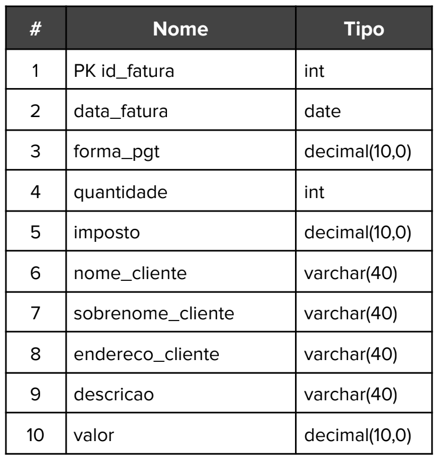
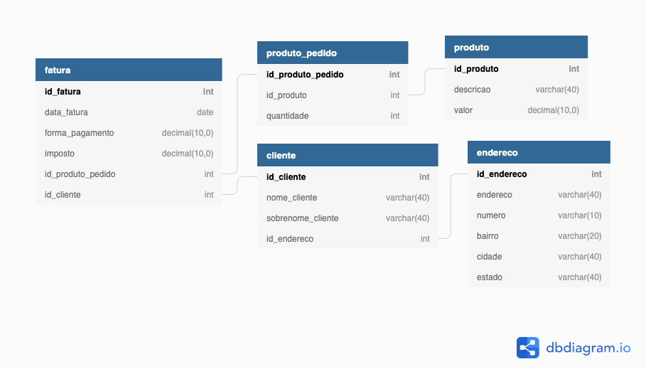

# Normalização

Exercício propõe a análise de sistema de faturamento e aplicação de regras de normalização, atinjindo um modelo DER na terceira forma normal (3NF).

A primeira forma normal tem relação com a atomicidade dos domínios. Dessa forma, para atingi-la é necessário criar registros separados para os dados duplicados e, na sequência, remover as colunas repetidas para tabelas próprias. Uma relação só estará na 1FN se todos os dados corresponderem a um único valor. No problema apresentado, embora não tenhamos exemplos de registros no banco, muito provavelmente a coluna endereço agrega valores que poderiam ser decompostos em endereço contendo endereco, número, complemento, cidade e estado.

A segunda forma normal exige a criação de tabelas próprias para valores que poderiam ser repetir em várias tabelas. 
No problema apresentado, as informações referentes ao endereço, decompostas para atendimento da 1FN, podem servir para para a fatura quanto para os clientes. Assim, faz sentido extrair essas informações para uma tabela prória.

A terceira forma normal (3FN) determina a remoção de subgrupos de dados em colunas de uma tabela para novas tabelas relacionadas entre si. Para estar na 3FN, não podem existir dados duplicados e cada coluna da tabela pode apenas ser identificada pela chave primária. Em outras palavras, buscamos campos não chave que dependam de outro campo não chave. Aqui, as informações relacionadas ao cliente (nome_cliente, sobrenome_cliente, endereco_cliente) não dependem da fatura, de modo que podem ser extraídos para uma tabela própria e a ela pode ser relacionada também a tabela endereço. Outra modificação a ser feita na tabela fatura seria extração dos valores 'descricao, valor e quantidade, porque parecem ter relação com os produtos que compõe uma fatura.

Atendendo o escrito acima, o modelo do banco na 3NF seria o seguinte: 

